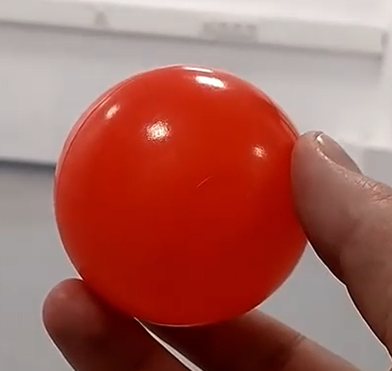

# Convex-Hull-Based-Real-Time-Object-Tracker-Using-Geometric-Shape-Analysis
This project explores **convex hull geometry** in real-time object tracking using video data. It combines computer vision and computational geometry to detect a red object, approximate its shape with a convex hull, and compare different geometric representations over time.

---

## Demo (Tracked Ball)

  
> The object is tracked using its convex hull (green), bounding rectangle (cyan), and minimum enclosing circle (yellow). Area and vertex count are displayed in real time.

---

## Features

- Real-time red object detection using HSV color filtering
- Convex hull computation (`cv2.convexHull`) with contour smoothing
-  Bounding rectangle and enclosing circle comparisons
- Dynamic tracking of:
  - Convex hull area
  - Vertex count (shape complexity)
- Motion trail tracking using centroids
- Output:
  - Annotated video (`output_with_hull.avi`)
  - Shape data CSV (`shape_data.csv`) with area and vertex count per frame

---

## Project Structure

convex-hull-object-tracker/

├── object_tracking_with_convex_hulls.py

├── [](https://youtu.be/fZF6gLqBHQo)

├── [](https://youtu.be/e1DXfnYTA8Y)

├── shape_data.csv

├── screenshot.png

├── graham_scan.py

├── README.md

---

## Computational Geometry Insight

### What is a Convex Hull?
A **convex hull** is the smallest convex shape that fully encloses a set of points — like stretching a rubber band around them.

In this project:
- The convex hull helps represent the moving object's shape efficiently.
- We compare it to a **bounding rectangle** and **minimum enclosing circle** to explore geometric trade-offs.

### Vertex Count and Shape Complexity
Using `cv2.approxPolyDP`, we estimate the object's contour shape and track the number of vertices — a rough proxy for **shape complexity**.

### Distance-Size Relationship
As the object gets closer to the camera, its projected area increases. This mimics how geometric projection changes with depth.

---

## Extra: Graham Scan (Manual Convex Hull Algorithm)

In [`graham_scan.py`](graham_scan.py), I implemented the **Graham Scan algorithm** from scratch to better understand convex hull construction.

---

## Getting Started

```bash
pip install opencv-python
python main.py
